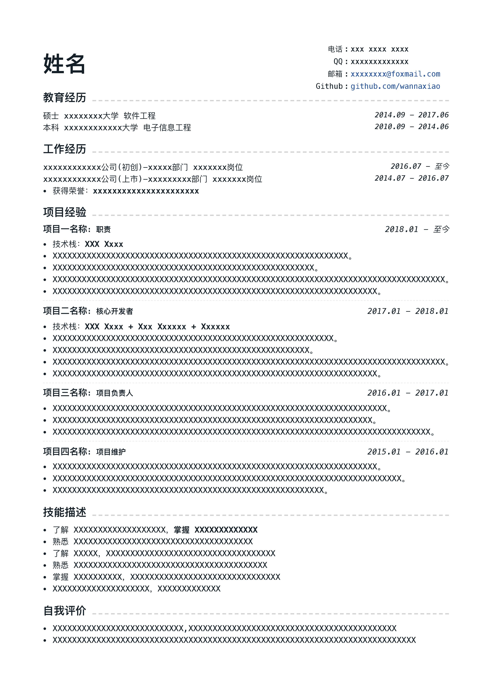

## 🐈 介绍

当我们在使用 markdown 书写简历时，都有哪些痛点 🤒？
1.  使用编辑器自带的 markdown 预览。缺点：不够精致(丑)emmmm
2.  使用 Bear (付费)。缺点：导出 pdf 时无法修改参数(默认字体过大/过宽，导致无法压缩成1页)emmmm

在试用了 Mac 上几乎所有的 markdown 软件之后，都不够满意 🤕...

于是...



## 🚀 开始

### 使用主题

```bash
yarn add -D vuepress-theme-resume # 或使用npm：npm i -D vuepress-theme-resume
```

```js
// .vuepress/config.js 中添加
theme: 'resume',
```

### 样式覆盖

创建 .vuepress/override.styl 文件

```css
/* font */
$fontSize = 13px
$fontWeight = 400

/* colors */
$accentColor = #4688F1
$textColor = #161F28
$borderColor = #eaecef
```

### 常见问题
> 如何导出为 pdf?

chrome 页面中右键 -> 打印 -> 另存为 pdf

> 导出的 pdf 如何控制只有 1 页？

方法一：.vuepress/override.styl 修改基准字体大小 $fontSize <br>
方法二：chrome 打印 -> 更多设置 -> 缩放

## 💡 协作

如果你有更好的想法，欢迎 PR 👏
